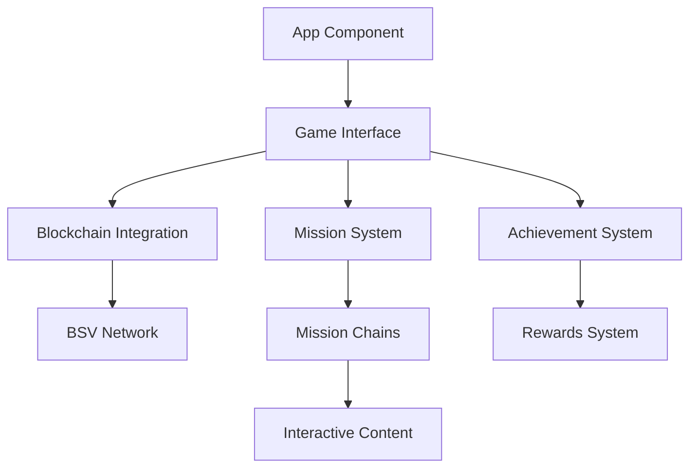

# DGE: 007 GOLDFINGER Documentation

## Overview

DGE: 007 GOLDFINGER is a blockchain-based game that demonstrates the power of Bitcoin SV (BSV) technology for government efficiency. Players take on the role of Digital Government Efficiency (DGE) agents working to reform inefficient government agencies and thwart Goldfinger's plans.

**Version:** 0.1.0  
**Last Updated:** 2024  
**Status:** Beta

## Table of Contents

1. [Technical Documentation](#technical-documentation)
   - [Architecture](#architecture)
   - [Setup & Installation](#setup--installation)
   - [Configuration](#configuration)
   - [Database Schema](#database-schema)
   - [Code Documentation](#code-documentation)
   - [Deployment](#deployment)

2. [User Documentation](#user-documentation)
   - [Getting Started](#getting-started)
   - [Game Features](#game-features)
   - [Troubleshooting](#troubleshooting)
   - [FAQs](#faqs)

3. [Administrative Documentation](#administrative-documentation)
   - [Maintenance](#maintenance)
   - [Security](#security)
   - [Monitoring](#monitoring)
   - [Incident Response](#incident-response)

## Technical Documentation

### Architecture

The application follows a modern React-based architecture with the following key components:



Key Components:
- **Frontend**: React + TypeScript + Vite
- **Styling**: Tailwind CSS
- **State Management**: Zustand
- **Blockchain**: BSV (Bitcoin SV)
- **Icons**: Lucide React
- **Animations**: Framer Motion

### Setup & Installation

1. Clone the repository:
```bash
git clone https://github.com/yourusername/dge-007-goldfinger.git
cd dge-007-goldfinger
```

2. Install dependencies:
```bash
npm install
```

3. Set up environment variables:
```env
VITE_TAAL_API_KEY=your_api_key_here
```

4. Start development server:
```bash
npm run dev
```

### Configuration

The application uses several configuration files:

- `vite.config.ts`: Vite bundler configuration
- `tailwind.config.js`: Tailwind CSS configuration
- `tsconfig.json`: TypeScript configuration
- `.env`: Environment variables

### Database Schema

The game uses local storage and blockchain transactions for data persistence:

```typescript
interface GameState {
  playerAddress: string;
  playerName: string | null;
  level: number;
  xp: number;
  balance: number;
  currentChainId: string | null;
  currentMilestoneId: string | null;
  chains: MilestoneChain[];
  badges: string[];
  transactions: string[];
}

interface Milestone {
  id: string;
  title: string;
  description: string;
  type: 'agency' | 'story';
  agency?: string;
  difficulty?: 'easy' | 'medium' | 'hard' | 'expert' | 'legendary';
  reward: number;
  completed: boolean;
  hash?: string;
  txid?: string;
  timestamp?: string;
  previousHash?: string;
  interactiveContent?: InteractiveContent;
}
```

### Code Documentation

#### Core Modules

1. **Game Logic (`src/utils/gameLogic.ts`)**
   - Handles game state management
   - Processes milestone completion
   - Manages progression system

2. **Blockchain Integration (`src/utils/blockchain-sdk.ts`)**
   - Manages BSV transactions
   - Handles wallet integration
   - Processes blockchain verification

3. **Demo Mode (`src/utils/demo.ts`)**
   - Provides offline gameplay
   - Simulates blockchain transactions
   - Manages demo state

### Deployment

The application can be deployed using Netlify:

1. Build the application:
```bash
npm run build
```

2. Deploy to Netlify:
```bash
netlify deploy --prod
```

## User Documentation

### Getting Started

1. **Account Creation**
   - Visit the game website
   - Click "Connect to Wallet" or use Demo Mode
   - Create your agent profile

2. **First Mission**
   - Complete DGE Agent Training
   - Learn about blockchain integration
   - Earn your first rewards

3. **Game Progression**
   - Complete mission chains
   - Earn BSV rewards
   - Unlock new missions

### Game Features

1. **Mission System**
   - Progressive mission chains
   - Interactive content types
   - Blockchain verification

2. **Rewards**
   - BSV cryptocurrency rewards
   - Achievement badges
   - Experience points

3. **Blockchain Integration**
   - Immutable progress tracking
   - Verifiable achievements
   - Real cryptocurrency rewards

### Troubleshooting

Common Issues and Solutions:

1. **Wallet Connection Issues**
   - Ensure your BSV wallet is properly configured
   - Check your internet connection
   - Try refreshing the page

2. **Transaction Delays**
   - Wait for blockchain confirmation
   - Check transaction status in explorer
   - Contact support if issues persist

### FAQs

1. **What is BSV?**
   - Bitcoin SV is the blockchain used for game transactions
   - Enables micropayments and data storage
   - Provides transparent verification

2. **How do rewards work?**
   - Complete milestones to earn BSV
   - Rewards are sent automatically
   - Verify in your BSV wallet

## Administrative Documentation

### Maintenance

Regular Maintenance Tasks:
1. Monitor blockchain integration
2. Update game content
3. Verify reward distribution
4. Check system performance

### Security

Security Measures:
1. Client-side private key handling
2. Blockchain transaction verification
3. Demo mode isolation
4. Input validation

### Monitoring

Key Metrics:
1. Transaction success rate
2. User progression
3. System performance
4. Error rates

### Incident Response

Response Procedures:
1. Transaction failures
2. Network issues
3. State management errors
4. User support